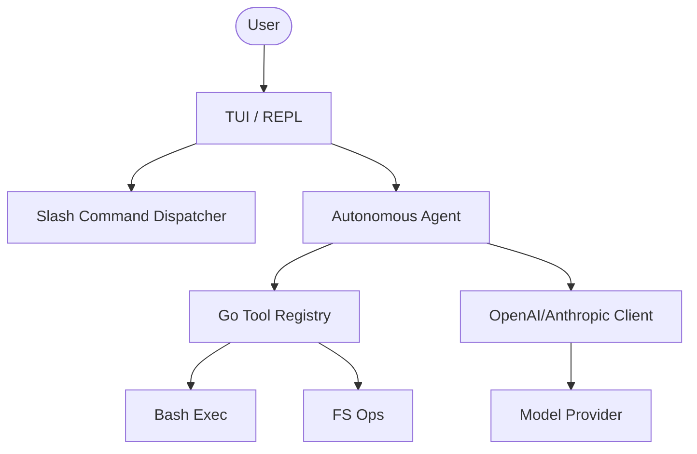

# OpenShannon-Go 🚀

Use Claude Code with **any LLM** — rewritten in high-performance Go.

OpenShannon-Go is a zero-dependency, clean-room rewrite of the [OpenClaude](https://github.com/Gitlawb/openclaude) project into Go. It provides a native, blazingly fast interface to use Claude Code's autonomous capabilities with OpenAI-compatible backends like GPT-4o, NVIDIA NIM, DeepSeek, Gemini, and local Ollama models.

All of Claude Code's tools — bash, file read/write, grep, glob, and even multi-step agent loops — are optimized for Go's concurrency model.

---

## Install

### Option A: Binary Download (Recommended)
Download the pre-compiled binary for your architecture from the [Releases](https://github.com/onedayallday33-a11y/openshannon-go/releases) page.

### Option B: From Source (Requires Go 1.21+)
```bash
# Clone the repository
git clone https://github.com/onedayallday33-a11y/openshannon-go.git
cd openshannon-go

# Build the binary
go build -o openshannon ./cmd/openshannon

# (Optional) Install to your GOBIN path
go install ./cmd/openshannon
```

---

## Quick Start

### 1. Set Environment Variables
```bash
export CLAUDE_CODE_USE_OPENAI=1
export OPENAI_API_KEY=sk-your-key-here
export OPENAI_MODEL=gpt-4o
```

### 2. Run OpenShannon
```bash
./openshannon
```
That's it. You'll enter a premium TUI (Terminal User Interface) with markdown support and a real-time thinking indicator.

---

## Provider Examples

### NVIDIA NIM (Integrated)
```bash
export CLAUDE_CODE_USE_OPENAI=1
export OPENAI_API_KEY=nvapi-...
export OPENAI_BASE_URL=https://integrate.api.nvidia.com/v1
export OPENAI_MODEL=openai/gpt-oss-20b
```

### Groq (Ultra-fast)
```bash
export CLAUDE_CODE_USE_OPENAI=1
export OPENAI_API_KEY=gsk_...
export OPENAI_BASE_URL=https://api.groq.com/openai/v1
export OPENAI_MODEL=llama-3.3-70b-versatile
```

### Ollama (Local & Free)
```bash
export CLAUDE_CODE_USE_OPENAI=1
export OPENAI_BASE_URL=http://localhost:11434/v1
export OPENAI_MODEL=llama3.3:70b
```

---

## Environment Variables

| Variable | Required | Description |
|----------|----------|-------------|
| `CLAUDE_CODE_USE_OPENAI` | Yes | Set to `1` to enable OpenAI-compatible mode |
| `OPENAI_API_KEY` | Yes* | Your API key (not needed for local providers) |
| `OPENAI_MODEL` | Yes | Model name (e.g., `gpt-4o`, `openai/gpt-oss-20b`) |
| `OPENAI_BASE_URL` | No | API endpoint (defaults to OpenAI) |
| `ANTHROPIC_API_KEY` | No | Needed if using raw Anthropic Claude mode |

---

## Features (What Works)

- **Premium TUI**: Rich terminal interface with ASCII art, markdown rendering, and status boxes.
- **Autonomous Loop**: Multi-step reasoning where the agent calls tools, interprets results, and reaches goals.
- **Smart Tooling**:
  - `bash`: Full shell command execution.
  - `file`: Safety-first read/write/edit operations.
  - `grep`/`glob`: Fast codebase searching.
  - `web`: Fetch content and search the web.
- **Slash Commands**: 
  - `/help`: Show available commands and shortcuts.
  - `/clear`: Reset chat history and session context.
  - `/model`: Switch between available LLM models.
  - `/doctor`: Perform a health check of the environment.
  - `/compact`: Condense long conversations to save tokens.
  - `/commit`: Automatically generate a git commit message.
  - `/review`: Request a code review of current changes.
  - `/exit`: Securely terminate the session.
- **Persistent Memory**: Automatic session saving and restoration in `~/.openshannon/`.

---

## How It Works (Go Architecture)



---

## Model Quality Notes

| Model | Tool Calling | Code Logic | Speed |
|-------|-------------|------------|-------|
| **GPT-4o** | Excellent | Top-tier | Fast |
| **Llama-3.3-70B** | Great | Very Good | Regular |
| **DeepSeek-V3** | Great | Excellent | Fast |
| **Gemini 2.0 Flash** | Good | Good | Ultra-fast |

---

## Origin

OpenShannon-Go is a performance-focused implementation built by the community to bridge the gap between heavy JavaScript environments and lightweight, native binary execution.

---

## License

This project is licensed under the MIT License.

---
*OpenShannon-Go is an independent project and is not affiliated with or endorsed by Anthropic.*